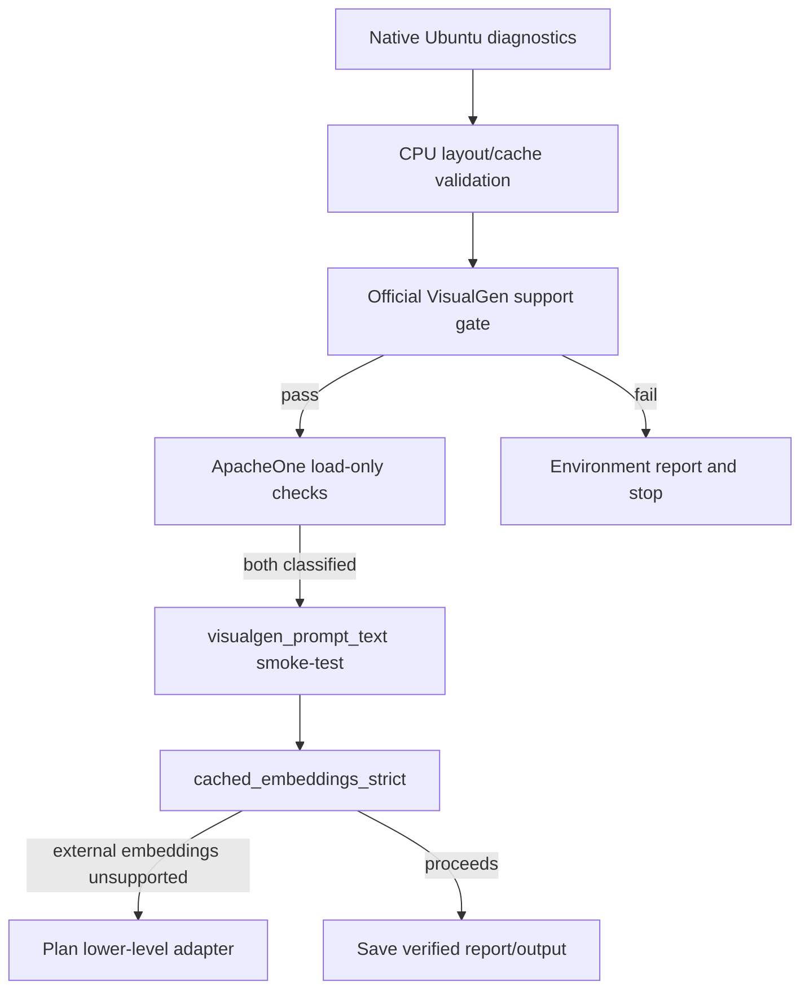

# Архитектура проекта

## Назначение

Проект исследует запуск **FLUX.2 Klein 9B-KV NVFP4** через TensorRT-LLM VisualGen или нижнеуровневый TensorRT-LLM pipeline. Главная задача — получить доказуемую совместимость и диагностируемый результат на target hardware, а не обойти ограничения fallback-ами.

## Целевая платформа

| Компонент | Целевое значение |
| --- | --- |
| ОС | Ubuntu 26.04 LTS, native runtime |
| GPU | NVIDIA Blackwell / GeForce RTX 50XX или новее |
| CUDA | 13.2 |
| Python | 3.13 |
| PyTorch | CUDA 13.2 wheels |
| Inference runtime | TensorRT + TensorRT-LLM, нативно установленный и совместимый с GPU/драйвером |
| Контейнеры | Не используются |

Базовая установка PyTorch:

```bash
pip3 install torch torchvision --index-url https://download.pytorch.org/whl/cu132
```

TensorRT и TensorRT-LLM не фиксируются произвольными версиями: они должны устанавливаться по актуальной официальной инструкции NVIDIA именно для CUDA 13.2, версии драйвера и Blackwell. Любой environment gate фиксирует реальные версии и пути библиотек.

## Логическая схема



Следующий шаг не начинается до того, как предыдущий дал сохранённый и классифицированный результат.

## Слои исходного кода

```text
src/flux2_kv/
  config.py                 Загрузка и проверка configs/project.yaml
  env.py                    Native Ubuntu/CUDA/GPU/TensorRT диагностика
  diagnostics.py            JSON-отчёты, stdout/stderr и traceback
  runtime_layout.py         Сборка VisualGen-compatible layout
  runtime_validation.py     CPU-only проверка layout
  checkpoint_inspection.py  Проверка заголовков ApacheOne safetensors
  prompt_cache.py           Чтение/запись prompt_tensors.safetensors
  generation_inputs.py      Строгая валидация входов генерации
  image_io.py               Нормализация фото и logo
  pipeline_adapter.py       Граница VisualGen/low-level TensorRT-LLM
  report.py                 Run report
scripts/
  00_ubuntu_check.py
  01_download_models.py
  02_encode_prompt.py
  03_prepare_inputs.py
  validate_runtime_dir.py
  inspect_apacheone_checkpoint.py
  mock_low_level_adapter_test.py
  check_visualgen_supported_model.py
  check_visualgen_load.py
  04_generate_once.py
  rtx50_first_run_check.py
```

Имена служат контрактом целевого состояния; файлы реализуются последующими спринтами согласно [plan.md](plan.md).

## Данные и модели

```text
models/
  apacheone/
    flux2-klein-9b-kv-nvfp4.safetensors
    flux2-klein-9b-kv-nvfp4_txtattnBF16.safetensors
  bfl/                       Companion configs/tokenizer/VAE
  experimental/text_encoder/aifeifei_4bit/
data/
  input/                     prompt.txt, user_photo.png, logo.png
  cache/images/              Normalized images
  cache/prompt/main_prompt_aifeifei_4bit/
  cache/visualgen_runtime/<variant>/
  diagnostics/
  output/
```

Большие веса, private inputs, кэш и результаты не коммитятся. Для runtime layout используется symlink на ApacheOne checkpoint, а не его дубликат.

Репозитории моделей:

- Base: `black-forest-labs/FLUX.2-klein-9b-kv`
- ApacheOne NVFP4: `ApacheOne/FLUX.2-klein-9b-kv-nvfp4_mixed`
- Экспериментальный text encoder: `aifeifei798/FLUX.2-klein-9B-text_encoder-4bit`

## Prompt cache и режимы

Канонический cache: `data/cache/prompt/main_prompt_aifeifei_4bit/prompt_tensors.safetensors`.

Обязательные tensors:

```text
prompt_embeds  [1, 512, 12288]  torch.bfloat16
text_ids       [1, 512, 4]      torch.int64
```

Есть ровно два режима:

1. `visualgen_prompt_text` — временный smoke-test публичного API, который может передать prompt text. В отчёте обязательны `prompt_cache_used=false` и `smoke_test_only=true`.
2. `cached_embeddings_strict` — итоговый путь, который читает только cache и не преобразует embeddings обратно в текст. Нельзя использовать prompt-text или Diffusers fallback.

Отказ public VisualGen принять external prompt embeddings — ожидаемый и диагностически полезный результат. Он указывает на API/adapter boundary, а не на необходимость менять сформированный cache.

## Контракты диагностики

Любая значимая проверка сохраняет JSON с полями: GPU name/capability, Blackwell eligibility, VRAM total/free, Ubuntu, NVIDIA driver, CUDA runtime, Python executable/version, PyTorch, TensorRT, TensorRT-LLM, `LD_LIBRARY_PATH`, модель, вариант, режим, использование cache, stdout/stderr (или пути и tail), детекторы OOM/unsupported arch/missing model/invalid safetensors и traceback.

Итог первого target run: `data/diagnostics/rtx50_first_run_report.json` с результатами official VisualGen, ApacheOne `full`, ApacheOne `txtattn_bf16`, prompt-text smoke-test и strict cached embeddings.

## Запрещённые архитектурные обходы

- Docker и любые container-only gates;
- скрытый Diffusers fallback;
- скрытый prompt-text fallback в strict mode;
- ComfyUI, Telegram, очереди и multi-worker;
- самостоятельная quantization до завершения Blackwell load-tests;
- признание результата GPU старее Blackwell NVFP4 acceptance.
