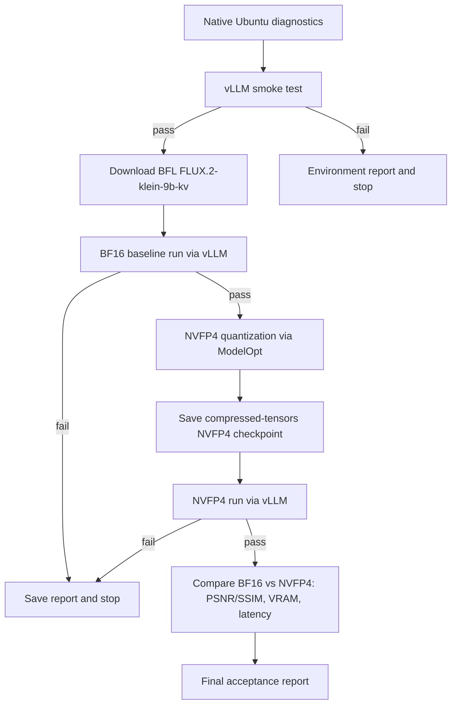

# Архитектура проекта

## Назначение

Проект запускает **FLUX.2 Klein 9B-KV** через **vLLM image-generation backend** на NVIDIA RTX 5090 (Blackwell, 32 GiB VRAM). Главная задача — получить воспроизводимый BF16 baseline через vLLM, затем провести NVFP4-квантизацию с явно задокументированным списком модулей и подтвердить, что NVFP4-результат метрически и визуально сравним с baseline при тех же prompt/seed. Проект не стремится обойти ограничения fallback-ами: Diffusers, ComfyUI, prompt-text path и CPU inference запрещены.

## Целевая платформа

| Компонент | Целевое значение |
| --- | --- |
| ОС | Ubuntu 26.04 LTS, native runtime |
| GPU | NVIDIA RTX 5090, Blackwell, compute capability 12.0, 32 GiB VRAM |
| CUDA | 13.2 (CUDA 13.3 запрещена) |
| Python | 3.14 |
| PyTorch | `2.13.0+cu132` |
| Inference backend | vLLM (image generation, FLUX.2 dispatch) |
| Quantization | NVIDIA ModelOpt → compressed-tensors NVFP4 checkpoint |
| Контейнеры | Не используются |

Базовая установка PyTorch:

```bash
pip3 install torch torchvision --index-url https://download.pytorch.org/whl/cu132
```

vLLM не ставится произвольной версией: он собирается из source-ветки, совместимой с Python 3.14 + CUDA 13.2 + Blackwell SM 12.0 + `torch 2.13.0+cu132`. Точная ветка, commit и патчи фиксируются в [INSTALLATION.md](INSTALLATION.md) и пере-проверяются каждым environment gate.

## Подтверждённая машина (требуется повторный замер в Sprint 002)

| Поле | Целевое значение |
| --- | --- |
| ОС | Ubuntu 26.04 LTS |
| GPU | NVIDIA GeForce RTX 5090 (Blackwell, CC 12.0, 32 GiB VRAM) |
| CUDA Toolkit | 13.2.78 (`/usr/local/cuda-13.2`, `nvcc` доступен) |
| Python | 3.14.4 (project venv) |
| PyTorch | `2.13.0+cu132`, GPU available |
| vLLM | source-build, version фиксируется Sprint 002 |
| Driver | актуальный проприетарный NVIDIA driver, поддерживающий RTX 5090 и CUDA 13.2 |

32 GiB VRAM достаточно для BF16 inference FLUX.2 Klein 9B (требование ~29 GiB VRAM по документации BFL) и для хранения NVFP4 checkpoint с headroom для activations.

## GPU-first и точность

BF16 baseline — обязательный первый путь. Все нейросетевые расчёты — text encoding (T5 + CLIP), transformer denoising, VAE decode и tensor transforms — выполняются на GPU 0. CPU разрешён только для I/O, YAML/JSON parsing, safetensors-header inspection и orchestration.

NVFP4 применяется строго к transformer-модулям. Решение о том, какие именно linear layers квантизировать, принимается в Sprint 004 на основе:
- inspect модуля модели (какие `nn.Linear` принадлежат attention projections, MLP, modulators);
- анализа VRAM-бюджета до/после квантизации;
- калибровки на фиксированном наборе промптов из `data/input/calibration_prompts.txt`.

Текущий дефолт `ignore_modules` в `configs/project.yaml`: `vae`, `tokenizer`, `t5`, `final_layer`. Этот список может быть расширен или сужен только отдельным спринтом с метрическим доказательством.

## Совместимость native vLLM

Рабочий runtime — source-build vLLM под Python 3.14, CUDA Toolkit 13.2, обязательный `torch 2.13.0+cu132` и Blackwell SM 12.0. vLLM использует Compressed-Tensors для загрузки NVFP4 checkpoint, поэтому Compressed-Tensors должен быть той же версии, что и в ModelOpt venv на этапе квантизации.

NVIDIA ModelOpt изолирован в `.venv-modelopt` вместе с совместимым Transformers и Hugging Face CLI; этот venv активируется `scripts/activate_modelopt_remote.sh`. vLLM runtime `.venv` не содержит ModelOpt (это устраняет историческую проблему eager-import ModelOpt при загрузке runtime).

Детальная процедура приведена в [workflow.md](workflow.md) и [INSTALLATION.md](INSTALLATION.md).

## Логическая схема



Следующий шаг не начинается до того, как предыдущий дал сохранённый и классифицированный результат.

## Слои исходного кода

```text
src/flux2_kv/
  config.py                 Загрузка и проверка configs/project.yaml
  env.py                    Native Ubuntu/CUDA/GPU/vLLM диагностика
  diagnostics.py            JSON-отчёты, stdout/stderr и traceback
  vllm_runner.py            Обёртка над vLLM image generation entrypoint
  checkpoint_inspection.py  Проверка заголовков safetensors и compressed-tensors
  image_io.py               Нормализация PNG/JPEG, copy в output
  quantization.py           ModelOpt NVFP4 pipeline (вызывается из .venv-modelopt)
  compare.py                PSNR/SSIM, latency, VRAM diff между запусками
  report.py                 Run report
scripts/
  00_ubuntu_check.py        Environment gate
  01_vllm_smoke.py          vLLM import + FLUX.2 model registry probe
  02_modelopt_smoke.py      ModelOpt venv sanity check
  03_model_readiness.py     HF access, BFL repo size, disk, GPU VRAM
  04_download_models.py     snapshot_download BFL repo
  05_bf16_baseline.py       vLLM FLUX.2 BF16 baseline run
  06_quantize_nvfp4.py      NVFP4 quantization (ModelOpt, isolated venv)
  07_quantized_run.py       vLLM FLUX.2 NVFP4 run
  08_compare_results.py     BF16 vs NVFP4 comparison
  activate_remote.sh        Activate .venv (vLLM runtime)
  activate_modelopt_remote.sh  Activate .venv-modelopt
tests/
  test_runtime_smoke.py     End-to-end: 01_vllm_smoke.py strict mode
```

Имена служат контрактом целевого состояния; файлы `src/flux2_kv/` реализуются последующими спринтами согласно [plan.md](plan.md). Скрипты-«заглушки» `05_*`..`08_*` на момент Sprint 001 содержат argparse + diagnostics JSON и явно помечены `not_implemented` — LLM-агент по мере выполнения спринтов заполняет их реальной логикой.

## Данные и модели

```text
models/
  bfl/                      black-forest-labs/FLUX.2-klein-9b-kv (BF16)
  bfl_nvfp4/                Compressed-tensors NVFP4 checkpoint (Sprint 004)
  experimental/             Опциональные сторонние артефакты
data/
  input/
    prompt.txt              Канонический baseline prompt
    calibration_prompts.txt Промпты для NVFP4 calibration
  cache/                    Опциональный vLLM prefix/prompt cache
  diagnostics/              JSON-отчёты (env, smoke, baseline, quant, run, compare)
  output/
    bf16_baseline/*.png
    nvfp4/*.png
```

Большие веса, private inputs, cache, output и diagnostics не коммитятся. Для NVFP4 checkpoint создается отдельный каталог `models/bfl_nvfp4/`; дублировать BF16 weights в NVFP4 каталоге запрещено (используются отдельные safetensors shards).

## Репозитории моделей

- Primary: `black-forest-labs/FLUX.2-klein-9b-kv` — официальный BFL repo.
- Сторонние репозитории (ApacheOne NVFP4 pre-quantized, aifeifei 4-bit text encoder) **не используются**: NVFP4 checkpoint создаётся самим проектом через ModelOpt, text encoder берётся из основного BFL repo.

## Режимы запуска

Проект поддерживает ровно два режима, оба через vLLM `model_type=image`:

| Режим | Назначение | Источник весов | Обязательные поля в отчёте |
| --- | --- | --- | --- |
| `bf16_baseline` | Эталонный путь, единственная baseline для всех будущих сравнений | `models/bfl/` | `mode=bf16_baseline`, `quantization=none`, `dtype=bfloat16` |
| `nvfp4_quantized` | Целевой путь после Sprint 004 | `models/bfl_nvfp4/` | `mode=nvfp4_quantized`, `quantization=nvfp4`, `target_modules=[...]`, `calibration_prompts_hash=...` |

Промежуточный `bf16_baseline_with_kv_cache` (если в Sprint 006 исследуется quantized KV cache) — отдельный режим, не подменяющий `bf16_baseline`.

## Контракты диагностики

Любая значимая проверка сохраняет JSON в `data/diagnostics/` с полями:

- host identifier без секретов;
- Ubuntu, kernel, NVIDIA driver, CUDA runtime/toolkit, Python executable/version;
- PyTorch version + CUDA;
- vLLM version + commit;
- GPU name, compute capability, VRAM total/free до и после запуска;
- `LD_LIBRARY_PATH`;
- режим (`bf16_baseline` / `nvfp4_quantized` / `quantization` / `smoke`);
- путь к модели / checkpoint;
- stdout/stderr (или пути и tail);
- классификаторы `oom`, `unsupported_arch`, `missing_model`, `invalid_safetensors`, `vllm_import_failed`;
- полный traceback при сбое;
- hash промптов и seed, чтобы сравнение BF16 vs NVFP4 было детерминированным.

Итоговые файлы:

- `data/diagnostics/ubuntu_env_check.json`
- `data/diagnostics/vllm_smoke.json`
- `data/diagnostics/model_readiness.json`
- `data/diagnostics/model_download.json`
- `data/diagnostics/bf16_baseline.json`
- `data/diagnostics/quantization.json`
- `data/diagnostics/nvfp4_run.json`
- `data/diagnostics/comparison_bf16_vs_nvfp4.json`

## Запрещённые архитектурные обходы

- Docker и любые container-only gates.
- TensorRT-LLM, VisualGen и любой C++ engine, отличный от vLLM.
- Скрытый Diffusers fallback; скрытый prompt-text fallback в quantized run.
- ComfyUI, Telegram, очереди и multi-worker.
- Самостоятельная «жадная» переквантизация всех слоёв без allowlist.
- Признание результата GPU старше Blackwell NVFP4 acceptance.
- Повторный text encoding после кэширования — если baseline зафиксировал embedding, NVFP4 run обязан использовать тот же pipeline.
