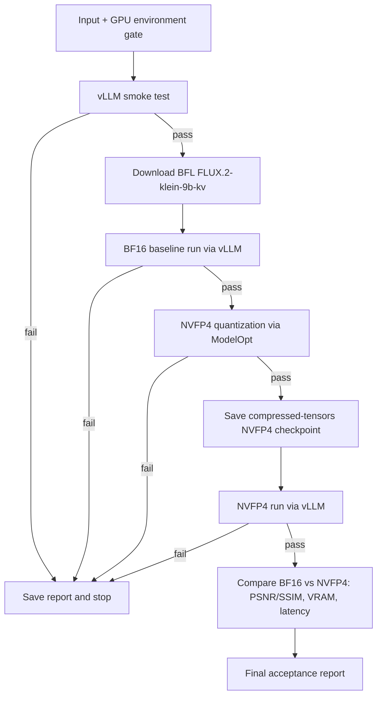

# Полный GPU-first процесс

Этот документ — исполняемый контракт работы на целевой машине. Он описывает порядок от входных файлов до сравнительного отчёта BF16 vs NVFP4, чтобы каждый шаг был воспроизводимым, а сбои оставались классифицированными.

## 0. Фактическая стартовая точка

Рабочая машина — Ubuntu 26.04 с NVIDIA GeForce RTX 5090 (Blackwell, CC 12.0, 32 GiB VRAM), CUDA Toolkit 13.2.78, Python 3.14.4 и проприетарным драйвером NVIDIA, поддерживающим RTX 5090. Точный host, driver, kernel и free VRAM фиксируются в `data/diagnostics/ubuntu_env_check.json` на каждом запуске.

Каждый GPU-спринт начинается с нового снимка:

```bash
nvidia-smi
nvcc --version
python3.14 --version
```

В отчёт пишутся версии GPU/driver/CUDA/Python и свободная VRAM. SSH-пароли, Hugging Face tokens и другие секреты в отчёт не включаются.

## 1. Граница данных: input

В Git хранятся только пустые каталоги. Пользовательские данные кладутся локально и никогда не коммитятся:

```text
data/input/prompt.txt                Канонический baseline prompt в UTF-8
data/input/calibration_prompts.txt   Промпты для NVFP4 calibration, один на строку
data/input/user_photo.png            Опциональное пользовательское фото для image-to-image
data/input/logo.png                  Опциональный logo, PNG с alpha
```

Правила подготовки:

1. `prompt.txt` читается как неизменяемый источник; его SHA-256 и длина фиксируются в baseline report.
2. `calibration_prompts.txt` должен содержать не менее 8 промптов разнообразной семантики; его hash фиксируется в `data/diagnostics/quantization.json`.
3. Изображения нормализуются (RGB/RGBA, корректная ориентация) только если они реально используются в текущем спринте. По умолчанию baseline работает text-to-image.
4. Декодирование PNG/JPEG и файловый I/O остаются CPU-операциями. После проверки изображения переводятся в GPU tensors; все model-side transforms выполняются на GPU.
5. Неверный формат, повреждённый файл или отсутствующая alpha для logo — явная ошибка с JSON-диагностикой, а не автоматическое изменение prompt/model.

## 2. Выбор модели и точностей

| Роль | Выбор | Точность / правило |
| --- | --- | --- |
| Primary model | `black-forest-labs/FLUX.2-klein-9b-kv` (BFL repo) | BF16 для baseline; NVFP4 weights + BF16 VAE/text-encoder для quantized run |
| Текстовый энкодер | T5 + CLIP из того же BFL repo | BF16; не квантизируется |
| VAE | Из того же BFL repo | BF16; не квантизируется |
| NVFP4 checkpoint | `models/bfl_nvfp4/` (создаётся Sprint 004) | Только transformer `nn.Linear` из `target_modules` allowlist |

Сторонние репозитории (ApacheOne, aifeifei 4-bit) **не используются**: NVFP4 checkpoint создаётся самим проектом, text encoder берётся из основного BFL repo.

## 3. Native framework и compatibility gate

Используется только native Ubuntu; Docker запрещён. Целевой runtime — Python 3.14 `.venv` с vLLM из source, PyTorch `2.13.0+cu132`, Compressed-Tensors, huggingface_hub. NVIDIA ModelOpt/Hugging Face CLI находятся в отдельном Python 3.14 `.venv-modelopt`.

```bash
# vLLM runtime
source scripts/activate_remote.sh
python scripts/00_ubuntu_check.py --strict
python scripts/01_vllm_smoke.py --strict

# Отдельно: NVIDIA ModelOpt и Hugging Face CLI
source scripts/activate_modelopt_remote.sh
python scripts/02_modelopt_smoke.py
```

Не запускайте `pip install -U` в `.venv`: pre-built vLLM metadata может попытаться понизить Torch или поставить несовместимую CUDA runtime. Полная воспроизводимая процедура source-build приведена в [INSTALLATION.md](INSTALLATION.md).

Проверка runtime:

```bash
python - <<'PY'
import torch, vllm
print('torch', torch.__version__, 'cuda', torch.version.cuda)
print('gpu', torch.cuda.get_device_name(0), torch.cuda.get_device_capability(0))
print('vllm', vllm.__version__)
assert torch.cuda.is_available()
assert torch.cuda.get_device_capability(0)[0] >= 10  # Blackwell or newer
from vllm.model_executor.models.registry import ModelRegistry
print('flux registered:', any('flux' in name.lower() for name in ModelRegistry.get_supported_archs()))
PY
```

## 4. GPU budget и инварианты исполнения

RTX 5090 имеет 32 GiB VRAM. Этого достаточно для BF16 inference FLUX.2 Klein 9B (требование ~29 GiB VRAM по документации BFL) и для NVFP4 checkpoint с большим headroom для activations.

Инварианты каждого прогона:

- `CUDA_VISIBLE_DEVICES=0`, `batch_size=1`, `1024×1024`, `steps=4`, `seed=42`, `guidance_scale=4.0` (см. `configs/project.yaml::generation`);
- сначала BF16 baseline, затем NVFP4 run; одновременно существует только один тяжёлый runtime;
- после каждого теста освобождаются ссылки на модель и GPU cache; в отчёт записывается VRAM до/после;
- OOM — валидный результат классификации, не повод автоматически снизить resolution, precision или переключить runtime;
- все ML-tensors, text encoder, transformer denoising и VAE decode должны оставаться на GPU; CPU-only fallback запрещён.

NVFP4 weights не означают, что любой компонент можно безопасно привести к FP4. Только модули из `target_modules` (фиксируются в Sprint 004) получают NVFP4 weights; VAE, tokenizer, T5, final_layer остаются BF16.

## 5. Обработка: download и inspection

### 5.1 Model readiness preflight

Read-only preflight проверяет HF access, размер BFL repo, свободное место на диске и VRAM:

```bash
source scripts/activate_modelopt_remote.sh
hf auth login
source scripts/activate_remote.sh
python scripts/03_model_readiness.py --strict --output data/diagnostics/model_readiness.json
```

Hugging Face CLI намеренно находится в `.venv-modelopt`; token сохраняется в пользовательском Hub cache и затем читается библиотекой `huggingface_hub` из `.venv` без установки CLI в vLLM runtime.

### 5.2 Download BFL repo

При `"status": "pass"`:

```bash
python scripts/04_download_models.py --output data/diagnostics/model_download.json
```

Скрипт скачивает только нужные assets (config, scheduler, tokenizer, transformer, vae, text_encoder) и не дублирует их.

### 5.3 Checkpoint inspection (CPU-only)

Перед любым GPU load запускается CPU-only safetensors inspection:

```bash
python - <<'PY'
from safetensors import safe_open
from pathlib import Path
for path in Path('models/bfl/transformer').glob('*.safetensors'):
    with safe_open(path, framework='pt', device='cpu') as f:
        keys = list(f.keys())
        print(path, len(keys), keys[:3])
PY
```

Цель — убедиться, что checkpoint не повреждён и содержит ожидаемые ключи. Несовпадение формата — явная ошибка с JSON-диагностикой.

## 6. Последовательность GPU-проверок



Исполняемый порядок после реализации соответствующих scripts:

```bash
python scripts/00_ubuntu_check.py --strict
python scripts/01_vllm_smoke.py --strict
python scripts/03_model_readiness.py --strict
python scripts/04_download_models.py
python scripts/05_bf16_baseline.py
# Switch to modelopt venv for quantization
source scripts/activate_modelopt_remote.sh
python scripts/06_quantize_nvfp4.py
# Back to vLLM runtime for quantized run
source scripts/activate_remote.sh
python scripts/07_quantized_run.py
python scripts/08_compare_results.py
```

Не запускать следующий шаг, пока предыдущий не сформировал отчёт с категорией `pass`, `fail` или `blocked`.

## 7. Два режима запуска

### `bf16_baseline`

Эталонный путь. vLLM загружает BF16 weights из `models/bfl/`, генерирует изображение по `data/input/prompt.txt` с seed=42, сохраняет `data/output/bf16_baseline/<seed>.png` и `data/diagnostics/bf16_baseline.json`. Обязательные поля отчёта:

```json
{
  "mode": "bf16_baseline",
  "quantization": "none",
  "dtype": "bfloat16",
  "seed": 42,
  "prompt_sha256": "...",
  "vram_before_mib": ...,
  "vram_after_mib": ...,
  "latency_s": ...
}
```

### `nvfp4_quantized`

Целевой путь после Sprint 004. vLLM загружает compressed-tensors NVFP4 checkpoint из `models/bfl_nvfp4/`, использует тот же prompt и seed, что и baseline. Обязательные поля отчёта:

```json
{
  "mode": "nvfp4_quantized",
  "quantization": "nvfp4",
  "target_modules": ["..."],
  "ignore_modules": ["vae", "tokenizer", "t5", "final_layer"],
  "calibration_prompts_sha256": "...",
  "seed": 42,
  "prompt_sha256": "...",
  "vram_before_mib": ...,
  "vram_after_mib": ...,
  "latency_s": ...
}
```

Если NVFP4 run падает с `unsupported_arch` или `compressed_tensors_load_failed`, результат записывается с явной классификацией; нельзя fallback на BF16 или Diffusers.

## 8. Сравнение BF16 vs NVFP4

`scripts/08_compare_results.py` читает `bf16_baseline.json` и `nvfp4_run.json`, сравнивает PNG из `data/output/bf16_baseline/` и `data/output/nvfp4/` (PSNR, SSIM), latency, VRAM. Сохраняет `data/diagnostics/comparison_bf16_vs_nvfp4.json` и side-by-side PNG в `data/output/comparison/`.

| Метрика | Verdict |
| --- | --- |
| PSNR ≥ 35 dB и SSIM ≥ 0.95 | `accept` |
| 25 ≤ PSNR < 35 или 0.85 ≤ SSIM < 0.95 | `investigate` (расширить `ignore_modules`, добавить calibration) |
| PSNR < 25 или SSIM < 0.85 | `reject` (NVFP4 схема не подходит для данной модели) |

Latency и VRAM delta фиксируются, но не являются acceptance-критерием: их цель — последующая оптимизация (Sprint 107 KV cache, Sprint 108 batch).

## 9. Отчёты, результаты и развилки

Каждый существенный шаг создаёт JSON в `data/diagnostics/`. Минимальные поля: host identifier без секретов, Ubuntu, GPU name/capability, driver, CUDA runtime/toolkit, VRAM total/free до и после, Python executable/version, PyTorch, vLLM version + commit, Compressed-Tensors version, `LD_LIBRARY_PATH`, модель, режим, seed, hash промпта, NVFP4 status, cache use, stdout/stderr paths/tail, OOM/unsupported architecture/missing model/invalid safetensors flags и traceback.

Итоговые артефакты:

```text
data/diagnostics/
  ubuntu_env_check.json
  vllm_smoke.json
  modelopt_smoke.json
  model_readiness.json
  model_download.json
  bf16_baseline.json
  quantization.json
  nvfp4_run.json
  comparison_bf16_vs_nvfp4.json
data/output/
  bf16_baseline/<seed>.png
  nvfp4/<seed>.png
  comparison/side_by_side_<seed>.png
```

## 10. Git и завершение каждого этапа

Скрипты и документация разрабатываются только в `sprint/<номер>-<имя>` ветке. Перед завершением: выполнить проверки, обновить `plan.md`, добавить запись в конец `changelog.md`, commit, `git push`, PR в `main` и merge. Прямой push содержательных изменений в `main` запрещён. Полные правила — в [rules.md](rules.md).
