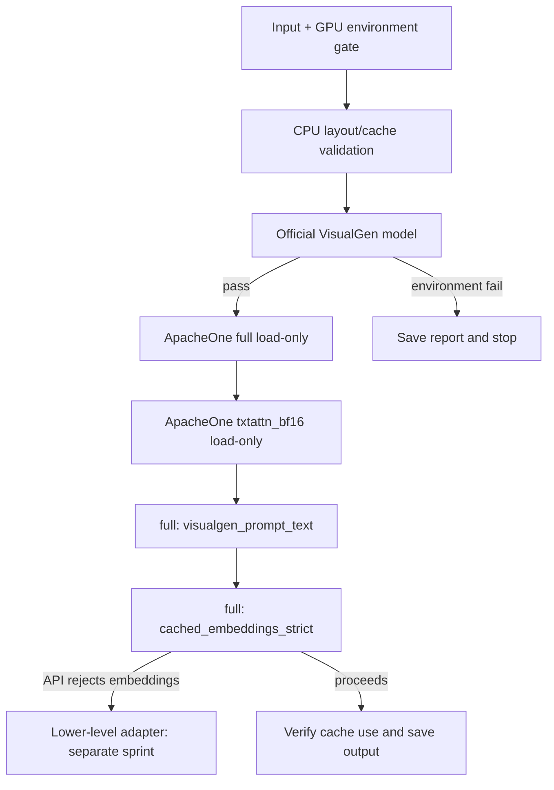

# Полный GPU-first процесс

Этот документ — исполняемый контракт работы на удалённой машине. Он описывает порядок от входных файлов до отчёта, чтобы NVFP4 путь был максимально использован, но сбои оставались классифицированными и воспроизводимыми.

## 0. Фактическая стартовая точка

Рабочая машина — Ubuntu 26.04 на `192.168.0.206`, GPU NVIDIA GeForce RTX 5060 Ti (Blackwell, CC 12.0), 16 GiB VRAM, driver 595.71.05, CUDA Toolkit 13.2.78 и 60 GiB RAM. Root LVM расширен до 936 GiB, свободно около 811 GiB. Native TensorRT-LLM runtime успешно установлен и проверен.

Каждый GPU-спринт начинается с нового снимка:

```bash
nvidia-smi
nvcc --version
python3.14 --version
```

В отчёт пишутся версии GPU/driver/CUDA/Python и свободная VRAM. SSH-пароли, Hugging Face tokens и другие секреты в отчёт не включаются.

## 1. Граница данных: input

В Git хранятся только пустые каталоги. Пользовательские данные кладутся локально на удалённой машине и никогда не коммитятся:

```text
data/input/prompt.txt       Точный текст prompt в UTF-8
data/input/user_photo.png   Исходное пользовательское фото
data/input/logo.png         Исходный logo, предпочтительно PNG с alpha
```

Правила подготовки:

1. `prompt.txt` читается как неизменяемый источник; его SHA-256 и длина фиксируются в metadata cache.
2. Фото преобразуется в RGB/RGBA с корректной ориентацией и нормализуется до `1024×1024` в `data/cache/images/user_photo/normalized_1024.png`.
3. Logo нормализуется без потери alpha до `512×512` в `data/cache/images/logo/normalized_512.png`.
4. Декодирование PNG/JPEG и файловый I/O остаются CPU-операциями. После проверки изображения переводятся в GPU tensors; все model-side transforms выполняются на GPU.
5. Неверный формат, повреждённый файл, отсутствующая alpha для требуемого logo или несовпавший размер — явная ошибка с JSON-диагностикой, а не автоматическое изменение prompt/model.

## 2. Выбор моделей и точностей

| Роль | Выбор | Точность / правило |
| --- | --- | --- |
| Основной transformer | `ApacheOne/FLUX.2-klein-9b-kv-nvfp4_mixed`, вариант `full` | NVFP4; первый и основной путь |
| Диагностический transformer | Тот же repo, `txtattn_bf16` | Проверяется отдельно только для локализации проблемы; не заменяет `full` молча |
| Companion layout | `black-forest-labs/FLUX.2-klein-9b-kv` | Берутся `model_index`, scheduler, tokenizer, `transformer/config.json`, VAE configs/weights; BFL transformer weights не нужны для ApacheOne path |
| Text encoder для cache | `aifeifei798/FLUX.2-klein-9B-text_encoder-4bit` | 4-bit, выполняется на GPU для создания cache |
| Официальный контроль | Официально поддерживаемая VisualGen-модель, по умолчанию `black-forest-labs/FLUX.2-dev` | Не является заменой рабочей модели; отделяет ошибку окружения от ApacheOne |

Файлы ApacheOne:

```text
models/apacheone/flux2-klein-9b-kv-nvfp4.safetensors
models/apacheone/flux2-klein-9b-kv-nvfp4_txtattnBF16.safetensors
```

Порядок выбора не меняется: сначала `full` NVFP4, затем только диагностически `txtattn_bf16`. Не переквантизировать модель самостоятельно и не подменять её Diffusers/ComfyUI.

## 3. Native framework и compatibility gate

Используется только native Ubuntu; Docker запрещён. Целевой TensorRT-LLM runtime — Python 3.14 `.venv`, PyTorch cu132, TensorRT и source-build TensorRT-LLM `1.3.0rc20`. NVIDIA ModelOpt/Hugging Face CLI находятся в отдельном Python 3.14 `.venv-modelopt`.

```bash
# TensorRT-LLM runtime
source scripts/activate_remote.sh
python scripts/00_ubuntu_check.py --strict
python scripts/01_runtime_smoke.py --strict

# Отдельно: NVIDIA ModelOpt и Hugging Face CLI
source scripts/activate_modelopt_remote.sh
python scripts/02_modelopt_smoke.py
```

Не запускайте `pip install -U` в `.venv`: pre-built metadata TensorRT-LLM несовместима с зафиксированным Torch и может попытаться изменить рабочий стек. Полная воспроизводимая процедура source-build приведена в [INSTALLATION.md](INSTALLATION.md).

Проверка runtime:

```bash
python - <<'PY'
import torch, tensorrt, tensorrt_llm
print('torch', torch.__version__, 'cuda', torch.version.cuda)
print('gpu', torch.cuda.get_device_name(0), torch.cuda.get_device_capability(0))
print('tensorrt', tensorrt.__version__)
print('tensorrt_llm', tensorrt_llm.__version__)
assert torch.cuda.is_available()
assert torch.cuda.get_device_capability(0)[0] >= 10
PY
```

## 4. GPU budget и инварианты исполнения

RTX 5060 Ti имеет 16 GiB VRAM. Поэтому одновременно существует только один тяжёлый runtime:

- `CUDA_VISIBLE_DEVICES=0`, `batch_size=1`, `1024×1024`, `steps=4`, `seed=42`, `guidance_scale=4.0`;
- сначала load-only, затем один variant за раз, затем один generation mode за раз;
- после каждого теста освобождаются ссылки на модель и GPU cache; в отчёт записывается VRAM до/после;
- OOM — валидный результат классификации, не повод автоматически снизить resolution, precision или переключить runtime;
- все ML-tensors, text encoder, transformer denoising и VAE decode должны оставаться на GPU; CPU-only fallback запрещён.

NVFP4 не означает, что любой компонент можно безопасно привести к FP4. Только опубликованный ApacheOne transformer `full` считается NVFP4 path. Companion VAE, tokenizer и API glue остаются в требуемых ими поддерживаемых форматах, чтобы система работала корректно.

## 5. Обработка: cache, layout и валидации

### 5.1 Prompt cache

GPU text encoder создаёт единственный канонический cache:

```text
data/cache/prompt/main_prompt_aifeifei_4bit/
  prompt.txt
  prompt_meta.json
  prompt_tensors.safetensors
```

Перед сохранением валидируются:

```text
prompt_embeds  [1, 512, 12288]  torch.bfloat16
text_ids       [1, 512, 4]      torch.int64
```

Именно этот cache используется strict mode. Его нельзя пересобрать «на всякий случай», превратить обратно в текст или заменить другим text encoder без нового доказательства причины.

### 5.2 VisualGen runtime layout

Для каждого variant создаётся каталог `data/cache/visualgen_runtime/<variant>/` с symlink на один большой ApacheOne checkpoint:

```text
model_index.json
scheduler/
tokenizer/
vae/
text_encoder/
transformer/config.json
transformer/diffusion_pytorch_model.safetensors -> models/apacheone/...
```

Symlink обязателен как первый выбор, чтобы не дублировать многогигабайтные weights. До GPU load запускаются CPU-only `validate_runtime_dir.py`, `inspect_apacheone_checkpoint.py` и `mock_low_level_adapter_test.py`.

## 6. Последовательность GPU-проверок



Исполняемый порядок после реализации соответствующих scripts:

```bash
python scripts/00_ubuntu_check.py --strict
python scripts/validate_runtime_dir.py
python scripts/inspect_apacheone_checkpoint.py
python scripts/mock_low_level_adapter_test.py
python scripts/check_visualgen_supported_model.py
python scripts/check_visualgen_load.py --variant full
python scripts/check_visualgen_load.py --variant txtattn_bf16
python scripts/04_generate_once.py --variant full --mode visualgen_prompt_text
python scripts/04_generate_once.py --variant full --mode cached_embeddings_strict
```

Не запускать следующий шаг, пока предыдущий не сформировал отчёт с категорией `pass`, `fail` или `blocked`.

## 7. Два режима генерации

### `visualgen_prompt_text`

Это GPU smoke-test публичного TensorRT-LLM VisualGen API. Он может использовать prompt text, но итоговый `run_report.json` обязан содержать:

```json
{
  "mode": "visualgen_prompt_text",
  "prompt_cache_used": false,
  "smoke_test_only": true
}
```

В случае успеха сохраняется `data/output/output.png`, но это подтверждает только публичный text path.

### `cached_embeddings_strict`

Это целевая GPU/NVFP4 архитектура. Она читает `prompt_tensors.safetensors`, передаёт `prompt_embeds` и `text_ids` в adapter и не принимает prompt text. Обязательные поля:

```json
{
  "mode": "cached_embeddings_strict",
  "prompt_cache_used": true,
  "smoke_test_only": false
}
```

Если public VisualGen не принимает external embeddings, результат записывается как `external_embeddings_unsupported`. Это ожидаемая граница API; нельзя fallback на prompt text, Diffusers или повторный encoding.

## 8. Отчёты, результаты и развилки

Каждый существенный шаг создаёт JSON в `data/diagnostics/`. Минимальные поля: host identifier без секретов, Ubuntu, GPU name/capability, driver, CUDA runtime/toolkit, VRAM total/free, Python executable/version, PyTorch, TensorRT, TensorRT-LLM, `LD_LIBRARY_PATH`, модель, variant, mode, NVFP4 status, cache use, stdout/stderr paths/tail, OOM/unsupported architecture/missing layout/invalid safetensors flags и traceback.

Итоговый `data/diagnostics/rtx50_first_run_report.json` содержит таблицу:

| Проверка | Возможные результаты | Следующее действие |
| --- | --- | --- |
| Environment gate | pass / compatibility blocker | При blocker менять только environment в новом спринте |
| Official VisualGen | pass / environment failure | При failure не трогать ApacheOne и cache |
| ApacheOne `full` load | pass / layout-loader failure / OOM | Сохранить отдельный отчёт |
| ApacheOne `txtattn_bf16` load | pass / fail | Использовать только для диагностики различий |
| Prompt-text | output / fail | Output не означает strict success |
| Strict cache | proceeds / embeddings unsupported / other failure | При unsupported проектировать adapter отдельно |

## 9. Git и завершение каждого этапа

Скрипты и документация разрабатываются только в `sprint/<номер>-<имя>` ветке. Перед завершением: выполнить проверки, обновить `plan.md`, добавить запись в конец `changelog.md`, commit, `git push`, PR в `main` и merge. Прямой push содержательных изменений в `main` запрещён. Полные правила — в [rules.md](rules.md).
